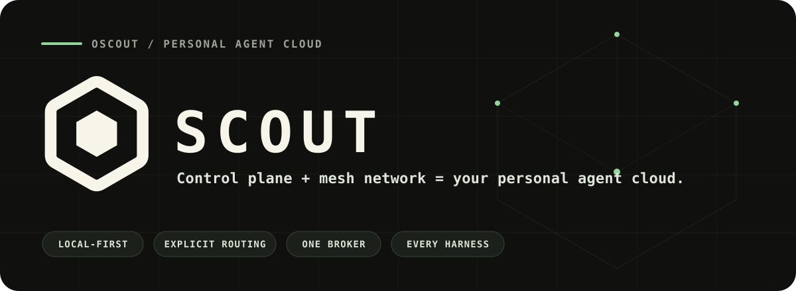

<p align="center">
  
</p>

<p align="center">
  <strong>Your personal cloud agent.</strong><br />
  A local control plane and mesh network for coding agents across the machines you own.
</p>

<p align="center">
  <a href="https://www.npmjs.com/package/@openscout/scout"></a>
  <a href="https://github.com/oscout/scout/blob/main/LICENSE"></a>
  <a href="https://oscout.net"></a>
</p>

---

Scout is the CLI, broker, runtime, protocol, and web control surface behind the
OpenScout agent mesh. It gives Codex, Claude Code, Cursor, Pi, and future
harnesses one explicit coordination model instead of a pile of one-off relays.

> **Local control plane + mesh network = your personal cloud agent.** Control
> stays with you while Scout makes sessions reachable and useful across your
> own machines.

> **Current posture:** Scout is for high-trust local developer pilots. It is
> not yet a hardened multi-tenant or compliance-ready control plane.

## Start in 60 seconds

Scout uses [Bun](https://bun.sh) as its runtime.

```bash
bun add -g @openscout/scout

scout setup
scout doctor
scout who
```

Then route real work from any project:

```bash
scout ask --project . --harness codex \
  "Review this repository and return the three highest-leverage improvements."
```

Scout resolves or starts the right local session, records the request with the
broker, and returns durable handles for follow-up.

## The small model

| You mean… | Use… | What Scout records |
| --- | --- | --- |
| “Heads up.” | `scout send --to <target>` | A durable message |
| “Do this and get back to me.” | `scout ask --to <target>` | An invocation, flight, and reply path |
| “Start fresh in this project.” | `scout ask --project . --harness <harness>` | A capability-routed session |
| “Continue that exact run.” | `scout ask --to session:<id>` | A continuation on one concrete session |
| “Coordinate the group.” | `scout send --channel <name>` | An explicit channel message |

One target is a DM. Group coordination uses a named channel. Broadcast is
opt-in. Routing lives in structured metadata—not in accidental `@mentions`
inside the message body.

## One broker, many surfaces

<!-- arc:control-plane:start -->

<!-- Generated from .github/diagrams/control-plane.arc.json by @arach/arc. -->

```text
                                                    ╔══════════════════════╗
                     ╔══════════════════════╗       ║ ◆ Local broker       ║
                     ║ ◆ Scout surfaces     ║       ║ canonical writer     ║
┌────────────────┐   ║ CLI + local web      ║   ┌──▶║ route + run          ║
│ ◆ Operator     │ ┌▶║ one control plane    ║───┘   ║                      ║
│ or agent       │─┘ ║                      ║       ╚══════════════════════╝
└────────────────┘   ╚══════════════════════╝                   │
                                                                │
                                                                │
                                              ┌─────────────────┴─────────┐
                                              │                           │
                                              ▼                           │
                                  ╔═══════════════════════╗               ▼
                                  ║ ◆ Harnesses + mesh    ║      ┌────────────────┐
                                  ║ Codex · Claude · ACP  ║      │ ◆ Records      │
                                  ║ reachable peers       ║      │ durable        │
                                  ║                       ║      │                │
                                  ╚═══════════════════════╝      └────────────────┘
```

<!-- arc:control-plane:end -->

The broker is the canonical writer for Scout-owned coordination records.
Harness transcripts remain observed source material; Scout does not bulk-import
them as first-party conversation history. “Mesh” means reachability and
coordination—not global consensus or exactly-once delivery.

## What ships here

| Surface | Path | Role |
| --- | --- | --- |
| CLI package | [`packages/cli`](./packages/cli) | `scout` command and bundled distribution |
| Broker/runtime | [`packages/runtime`](./packages/runtime) | routing, mesh, pairing, knowledge, durable work |
| Shared protocol | [`packages/protocol`](./packages/protocol) | wire types, identities, runtime catalog |
| Harness sessions | [`packages/agent-sessions`](./packages/agent-sessions) | observed session descriptors and lifecycle |
| Web foundation | [`packages/web`](./packages/web) | reusable web primitives, app shell, basic structural pages, and local server |
| Trace tooling | [`packages/session-trace`](./packages/session-trace) | portable trace model and React viewer |
| Native services | [`crates`](./crates) | `scoutd`, repo service, portable voice core |

The OpenScout macOS and iOS applications and hosted product services are built
in a private companion workspace. Public modules have one canonical home here;
the private product consumes and extends them instead of carrying a second
copy. See the [public-source boundary](./docs/public-source-boundary.md) for the
ownership model and release invariants.

## Work on Scout

```bash
git clone https://github.com/oscout/scout.git
cd scout
bun install

bun run --cwd packages/cli build
./packages/cli/bin/scout --version
```

Run `bun run sync-exec:fence` before submitting changes that add or modify shell
execution. Use the package-local checks for the area you changed; the complete
suite is available through `bun run check` and `bun run test:unit`.

## Go deeper

- [Install and verify](./install.md) — supported installation paths and clear success criteria
- [CLI guide](./packages/cli/README.md) — setup, routing, profiles, sessions, and operator commands
- [Runtime guide](./packages/runtime/README.md) — broker and runtime internals
- [Protocol guide](./packages/protocol/README.md) — integration contracts and shared types
- [Agent sessions](./packages/agent-sessions/README.md) — harness observation and session models
- [Public-source boundary](./docs/public-source-boundary.md) — what ships here and how package/source parity stays verifiable
- [Architecture diagram source](./.github/diagrams/control-plane.arc.json) — editable Arc model behind the README diagram
- [Brand assets](./.github/assets/README.md) — canonical mark, hero, avatar, and social preview sources
- [OpenScout](https://oscout.net) — product context and project home

## License

Apache-2.0. See [LICENSE](./LICENSE).
