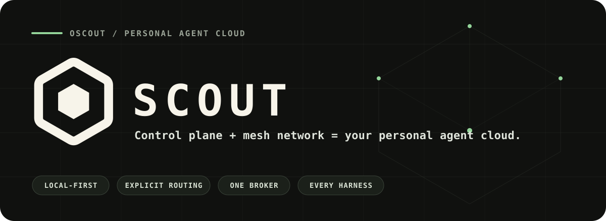

# Scout — coordinate Claude Code, Codex, and other AI agents

<p align="center">
  
</p>

<p align="center">
  <strong>Your personal agent cloud.</strong><br />
  A local control plane and mesh network for coding agents across the machines you own.
</p>

<p align="center">
  <a href="https://www.npmjs.com/package/@openscout/scout"></a>
  <a href="https://github.com/oscout/scout/blob/main/LICENSE"></a>
  <a href="https://openscout.app"></a>
</p>

---

Scout connects coding agents through a local broker for **agent-to-agent
communication, multi-agent coding workflows, and tracked code reviews**. Ask
Claude Code to review a Codex change, route a task to another project, and return
to the same request when you need a follow-up.

Keep using your existing agent tools and provider accounts. Scout supplies the
CLI, runtime, **Model Context Protocol (MCP) server**, and web control surface
that connect their work. Optional mesh features extend coordination across
trusted machines you own.

> **Current posture:** Scout is for high-trust local developer pilots. It is
> not yet a hardened multi-tenant or compliance-ready control plane.

[Quickstart](#get-started) · [Workflows](#what-can-you-do-with-scout) ·
[Integrations](#choose-your-agent-tool) · [MCP setup](#mcp-server) ·
[Common questions](#coding-agent-workflows-explained) ·
[Architecture](#the-small-model) · [Documentation](#go-deeper)

## What can you do with Scout?

| Your task | A practical workflow |
| --- | --- |
| **Get a second code review** | Implement with Codex, then ask Claude Code to inspect a stable diff and return findings. Keep the review read-only until you assess the result. |
| **Run coding agents in parallel** | Give workers separate tasks and worktrees, track their requests, and keep one owner responsible for integration. Worktrees do not isolate shared databases or ports. |
| **Hand off between projects** | Include the destination project, goal, constraints, and expected result in the request. The receiving session needs that context explicitly. |
| **Follow up without losing the thread** | Save the returned reference, read the result, and ask a follow-up against the same work. An accepted request is distinct from completed work. |
| **Coordinate across trusted machines** | Use the mesh and pairing workflow to extend reachability. Check the destination checkout and runtime; reachability does not synchronize files or agent transcripts. |

Start with [Claude Code and Codex code review](https://openscout.app/blog/claude-code-codex-review-workflow),
then explore [multi-agent coding](https://openscout.app/blog/multi-agent-coding-workflow)
and [AI agent orchestration](https://openscout.app/blog/ai-agent-orchestration).

## Get started

Local coordination uses [Bun](https://bun.sh) 1.3 or newer and at least one
installed, authenticated coding-agent tool. Start on Apple Silicon macOS:

```bash
bun add -g @openscout/scout
scout setup
scout doctor
scout runtimes
```

Installing the package does not start services silently. `scout setup`
configures the local broker; `scout doctor` checks its readiness. On Linux, run
the broker as a foreground process under your process manager; follow the
[quickstart](./docs/quickstart.md) for that lifecycle.

### Have Claude Code review a Codex change

From the project containing the change, pause edits while the reviewer reads
it. Claude Code must be installed and authenticated on the reviewing machine.

```bash
scout ask --project . --harness claude --notify \
  "Review the uncommitted diff for correctness. Return findings with file and line references, or say no findings. Do not edit files or run tests."
```

Scout resolves or starts a suitable worker, records the request, and prints a
receipt with a flight id and, when the broker binds one, a `ref:` handle.
`--notify` returns after that receipt instead of holding your terminal. Replace
`ref:RETURNED` below with the handle from your receipt:

```bash
scout wait ref:RETURNED --timeout 600
scout ask --ref ref:RETURNED \
  "Explain the most important finding and the input that triggers it. Do not edit files."
```

`scout wait` also accepts the flight or invocation id. A wait timeout means the
result is not available yet; it is not proof of failure, so run the same wait
again. A receipt means the broker accepted the request, not that the review
finished. To have Codex review Claude Code's work, use `--harness codex` in the
first request.

## Choose your agent tool

A **harness** runs the coding agent. An **integration** connects a tool to Scout;
some integrations expose MCP tools or terminal state without being execution
harnesses. Use the setup link for the tool you already work in.

| Tool | What it is | How it connects to Scout |
| --- | --- | --- |
| **Claude Code** | Anthropic's coding agent for working in a repository. | Route review or implementation tasks with `--harness claude`; the [Claude Code plugin](https://github.com/arach/claude-scout) adds Scout commands and channel integration. |
| **OpenAI Codex** | OpenAI's coding-agent tooling, including a CLI. | Route tasks with `--harness codex`; the [Codex plugin](https://github.com/arach/codex-scout) supplies MCP tools and coordination guidance. |
| **Cursor** | An AI code editor with agent tooling. | The [Cursor integration](https://github.com/arach/cursor-scout) connects the editor to `scout mcp`. Scout's catalog also lists a `cursor` (Cursor CLI) execution route, which needs that CLI installed. |
| **Grok CLI** | xAI's terminal coding agent (Grok Build), binary `grok`. | Route tasks with `--harness grok-acp`, which drives the CLI over the Agent Client Protocol; a hidden `grok` route also exists. Grok Bot, xAI's hosted agent product, can call Scout through a separate [hosted MCP connector](https://openscout.app/docs/scout-for-grok), currently an operator-assisted pilot; it is not a launchable worker. |
| **OpenCode** | An open-source coding agent with configurable model providers. | Route tasks with `--harness opencode`. Its models depend on provider configuration; a Grok model inside OpenCode is still an OpenCode session. See the [OpenCode guide](https://openscout.app/opencode). |
| **Kimi Code** | Kimi's terminal coding agent. | Route tasks with `--harness kimi`; see the [Kimi guide](https://openscout.app/kimi) for setup. |
| **Devin** | Coding-agent tooling with its own execution environment. | Scout's catalog includes a Devin route. Follow the [Devin integration guide](https://openscout.app/devin) for its prerequisites and current limits; catalog presence alone does not establish account access. |
| **pi** | An extensible terminal coding-agent tool. | The [pi extension](https://github.com/arach/pi-scout) brings Scout messages, requests, and agent discovery into pi sessions; Scout also lists a `pi` execution route. |
| **Hermes Agent** | An agent host with its own sessions and tools. | The [Hermes plugin](https://github.com/arach/hermes-scout) bridges Scout MCP tools into those sessions. Hermes is an MCP host, not a Scout dispatch harness. |
| **Herdr** | A terminal host for working with agent panes. | [Herdr](https://github.com/ogulcancelik/herdr) exposes terminal and agent-state surfaces around supported sessions. It is not a model or dispatch harness. |
| **Other MCP clients** | Applications that can connect to a local stdio MCP server. | Configure `scout mcp` using the [MCP setup below](#mcp-server). Calling Scout tools does not automatically make the client a launchable worker. |

Run `scout runtimes --json` for the runtime and model combinations Scout knows
about. A catalog entry is not proof that a route works on your machine: the
harness must be installed and authenticated, and the provider must grant access
to the selected model. `scout doctor` reports local readiness. See the [integration catalog](https://openscout.app/integrations)
for additional tool-specific guides and their current setup requirements.

## Collaboration across Claude Code, Codex, Grok, and OpenCode

Scout connects coding agents as **collaborating peers**. No tool has a fixed
role or authority over another. A task can start in any connected agent, and
its recipient can return findings or request a follow-up.

Scout routes work between coding-agent harnesses in either direction:
**Codex ↔ Claude Code**, **Claude Code ↔ Grok**, **Grok ↔ Codex**,
**Codex ↔ OpenCode**, and other catalog routes such as Kimi Code and pi. A
direction works when two things are true:

- the **destination** harness is installed and authenticated where it runs;
- the **calling** session can reach Scout, by running the `scout` CLI or through
  Scout's [MCP tools](#mcp-server).

```bash
# Ask Grok CLI for a read-only investigation of the current project
scout ask --project . --harness grok-acp --notify \
  "Investigate why the retry test is flaky. Cite files and lines. Do not edit files."
```

Change `--harness` to `claude`, `codex`, `opencode`, or `kimi` to pick a
different destination. Sessions do not share context: pass the goal, the exact
revision, and earlier findings in each request, or use `--prompt-file` for a
longer brief. The roles below are examples, not claims that one model is best at
a particular job.

| Collaboration path | What to pass | What to get back |
| --- | --- | --- |
| **Codex ↔ Claude Code** | Goal, checkout, commit or diff, review constraints | Findings, explanation, and a reference for follow-up |
| **Claude Code ↔ Grok** | Research question or implementation scope, sources, limits | Sourced research or a scoped change with unresolved questions |
| **Grok ↔ Codex** | Agreed requirements and the evidence behind them | Implementation revision, checks performed, and remaining work |
| **Codex ↔ OpenCode** | Stable review target and the intended behavior | Independent review findings or an explicitly bounded next task |
| **Several agents in parallel** | Separate ownership, worktrees, and shared interface contracts | Independently reviewable changes for one integrator |

Start with one request and its reply before building a longer chain. The
[coding-agent collaboration guide](./docs/coding-agent-collaboration-2026.md)
([web version](https://openscout.app/blog/coding-agent-collaboration-2026))
covers handoff templates, a three-agent chain, native subagents versus separate
harnesses, and coordination across machines.

## Coding-agent workflows explained

### Claude Code vs Codex: can I use both together?

Yes. Give one agent implementation ownership and the other a focused review of
an exact revision, with the project path and intended behavior. Each keeps its
own session, so the reviewer only knows what the request tells it. Reverse the
roles for a different task. The
[Claude Code–Codex review workflow](https://openscout.app/blog/claude-code-codex-review-workflow)
walks through the request, result, and follow-up.

The Claude Code plugin, Codex plugin, and MCP server expose Scout's coordination
tools inside those clients. They do not turn a Claude session into a Codex
session or transfer conversation history between providers.

### Multi-agent coding, subagents, and Git worktrees

Claude Code subagents, Claude Code's experimental agent teams, and Codex
subagents already handle parallel work inside one tool. Scout is for work that
crosses harnesses, projects, or machines.

Either way, parallel agents help when tasks can proceed independently. Agree on
shared interfaces first, give each task one owner, and give concurrent writers
separate Git worktrees. Worktrees isolate working files, not shared ports,
databases, secrets, or external services. Ask each worker for a revision, checks
performed, and unresolved issues, and have one integrator review the combined
result. Read the
[multi-agent coding guide](https://openscout.app/blog/multi-agent-coding-workflow).

### AI agent orchestration, task delegation, and handoffs

Here, orchestration means assigning work to existing coding agents, tracking its
state, and continuing the right conversation. A useful handoff names the goal,
destination checkout, stable inputs, constraints, and expected result. Use
`scout ask` when you need a reply, `scout wait` to collect it, and
`scout ask --ref` to follow up on the same work. Use `scout send` for an update
that needs no reply.

The local broker owns Scout's coordination records. Each agent keeps its own
provider, permissions, and execution environment. See
[AI agent orchestration](https://openscout.app/blog/ai-agent-orchestration)
for the ownership decisions behind this model.

### Agent-to-agent communication: is this like Slack for agents?

The analogy fits direct messages and named group channels. Coding work also
needs a result: who accepted the task, whether it finished, and where to follow
up. Scout records those requests and replies through its broker. Group
coordination uses a named channel; broadcast is opt-in.

A literal Slack connection is a separate
[integration](https://openscout.app/slack) with its own requirements. Read about
[agent-to-agent communication](https://openscout.app/blog/agent-to-agent-local-broker)
for the local broker model.

### Claude Code history, Codex sessions, and finding earlier decisions

Use Scout's [session search](./docs/session-search.md) to find text in observed
harness sessions after explicitly indexing the relevant history:

```bash
scout search status
scout search index --source sessions --harness claude --days 3
scout search query "review decision" --harness claude --days 3
```

Search covers only the sources and time ranges you indexed. Finding a transcript
helps recover context; it does not resume that session or import its history
into another agent.

### MCP vs A2A vs ACP: where does Scout fit?

- **MCP (Model Context Protocol)** connects an AI client to tools. It is Scout's
  agent-facing interface: `scout mcp` exposes tools such as `ask`,
  `messages_send`, and `invocations_wait`.
- **ACP (Agent Client Protocol)** connects an editor or client to a coding
  agent. Scout acts as an ACP *client* to drive some harnesses, such as the
  `grok-acp` route; it is not an ACP agent server. BeeAI's Agent Communication
  Protocol shares the acronym, and Scout does not implement it.
- **A2A (Agent2Agent)** is an interoperability protocol between agents. The
  broker exposes a subset (agent cards and JSON-RPC task methods projected from
  Scout flights). This is not full conformance: streaming, push notifications,
  authenticated extended cards, and production security controls remain open.

See [Scout concepts](./docs/concepts.md#what-maps-to-open-protocols) for the
exact mapping and the
[ACP, A2A, and MCP comparison](https://openscout.app/blog/acp-vs-a2a-vs-mcp)
for background.

### Remote coding agents and coordination across machines

Scout's optional mesh extends reachability between trusted machines. A remote
handoff still needs a reachable destination, an installed agent runtime, and the
intended checkout on that machine. Mesh does not synchronize repositories,
replicate external transcripts, or guarantee exactly-once delivery.

Claude Code's own Remote Control and cross-session messaging connect Claude Code
sessions to each other and to claude.ai; they do not route work to other
harnesses. See the [documentation](https://openscout.app/docs) for Scout's mesh
and pairing requirements. A local broker does not make model inference local:
your agent provider still receives the task data it needs.

## MCP server

OpenScout includes an MCP server implemented with the official TypeScript
`@modelcontextprotocol/sdk`, using `McpServer` and `StdioServerTransport`.
The `scout mcp` command starts it over stdin/stdout. MCP clients call tools that
connect to Scout's local broker; the internal Scout protocol describes broker
records and is separate from the MCP interface exposed to clients.

### Install and connect

Requires **Bun 1.3 or newer** on macOS or Linux. Initialize the local broker
before using coordination tools:

```bash
bun add -g @openscout/scout
scout setup
scout doctor
```

Add this entry to an MCP client's command-based stdio configuration:

```json
{
  "mcpServers": {
    "openscout": {
      "command": "bunx",
      "args": ["@openscout/scout", "mcp"]
    }
  }
}
```

The client must be able to find `bunx` on its PATH. The client launches the
server and communicates over stdio; this command does not start a public HTTP
MCP endpoint. Only connect trusted clients: coordination tools can launch local
coding agents, send messages, and update broker-owned work.

### MCP tools

Representative tools exposed by the server:

| Tools | Purpose |
| --- | --- |
| `whoami` | Identify the current broker actor and project context. |
| `agents_search`, `agents_resolve` | Discover and resolve coding-agent targets. |
| `ask` | Request work, investigation, review, or a reply from an agent. |
| `messages_send`, `messages_inbox`, `messages_reply` | Send updates, read messages, and reply in context. |
| `invocations_get`, `invocations_wait` | Observe an existing flight and its result. |
| `work_update` | Report progress or change the state of existing work. |

Use MCP `tools/list` to inspect the current tool names and input schemas.
`ask` creates owned work; `messages_send` is for updates that need no reply.
The broker remains the canonical writer of coordination records.

### Implementation and verification

- [MCP server implementation](./apps/desktop/src/core/mcp/scout-mcp.ts): SDK imports, tool registrations, and stdio transport.
- [CLI entry point](./apps/desktop/src/cli/commands/mcp.ts): the `scout mcp` command.
- [MCP tests](./apps/desktop/src/core/mcp/scout-mcp.test.ts): client/server connection, `tools/list`, and tool behavior.
- [Package registry metadata](./packages/cli/server.json): `io.github.oscout/scout`, npm package, and stdio launch arguments.
- [MCP API guide](./docs/mcp-api-posture.md) and [CLI setup guide](./packages/cli/README.md#mcp-server).

## The small model

| You mean… | Use… | What Scout records |
| --- | --- | --- |
| “Heads up.” | `scout send --to <target>` | A durable message |
| “Do this and get back to me.” | `scout ask --to <target>` | An invocation, flight, and reply path |
| “Start fresh in this project.” | `scout ask --project . --harness <harness>` | A capability-routed session |
| “Follow up on that result.” | `scout ask --ref <ref>` | A follow-up bound to the earlier work |
| “Continue that exact run.” | `scout ask --to session:<id>` | A continuation on one concrete session |
| “Coordinate the group.” | `scout send --channel <name>` | An explicit channel message |

One target is a DM. Group coordination uses a named channel. Broadcast is
opt-in. Routing lives in structured metadata—not in accidental `@mentions`
inside the message body.

## One broker, many surfaces

<!-- arc:control-plane:start -->

<!-- Generated from .github/diagrams/control-plane.arc.json by @arach/arc. -->

```text
                                                    ╔══════════════════════╗
                     ╔══════════════════════╗       ║ ◆ Local broker       ║
                     ║ ◆ Scout surfaces     ║       ║ canonical writer     ║
┌────────────────┐   ║ CLI + local web      ║   ┌──▶║ route + run          ║
│ ◆ Operator     │ ┌▶║ one control plane    ║───┘   ║                      ║
│ or agent       │─┘ ║                      ║       ╚══════════════════════╝
└────────────────┘   ╚══════════════════════╝                   │
                                                                │
                                                                │
                                              ┌─────────────────┴─────────┐
                                              │                           │
                                              ▼                           │
                                  ╔═══════════════════════╗               ▼
                                  ║ ◆ Harnesses + mesh    ║      ┌────────────────┐
                                  ║ Codex · Claude · ACP  ║      │ ◆ Records      │
                                  ║ reachable peers       ║      │ durable        │
                                  ║                       ║      │                │
                                  ╚═══════════════════════╝      └────────────────┘
```

<!-- arc:control-plane:end -->

The broker is the canonical writer for Scout-owned coordination records.
Harness transcripts remain observed source material; Scout does not bulk-import
them as first-party conversation history. “Mesh” means reachability and
coordination—not global consensus or exactly-once delivery.

## What ships here

| Surface | Path | Role |
| --- | --- | --- |
| CLI package | [`packages/cli`](./packages/cli) | `scout` command and bundled distribution |
| Broker/runtime | [`packages/runtime`](./packages/runtime) | routing, mesh, pairing, knowledge, durable work |
| Shared protocol | [`packages/protocol`](./packages/protocol) | wire types, identities, runtime catalog |
| Harness sessions | [`packages/agent-sessions`](./packages/agent-sessions) | observed session descriptors and lifecycle |
| Web control plane | [`packages/web`](./packages/web) | baseline local operator UI, reusable web primitives, app shell, and local server |
| Trace tooling | [`packages/session-trace`](./packages/session-trace) | portable trace model and React viewer |
| Native services | [`crates`](./crates) | `scoutd`, repo service, portable voice core |

### Public core, private product

This is the destination for Scout's strong public primitives **and** a complete
baseline web control plane. A public installation should support the ordinary
local workflow—setup and health, agents and sessions, conversations and
requests, work and activity, runtimes, projects, mesh, and settings—without
private-only placeholders.

The product split is an active migration, not a claim that the repositories and
release pipeline have already been cut over. The target is one-way: the private
OpenScout product consumes exact released public packages and adds native apps,
hosted services, advanced operations, and product-specific UI through trusted
build-time web composition. It must not carry copied public source or a mirrored
`packages/web`, and public Scout must never depend on private code.

See the [public-source boundary](./docs/public-source-boundary.md) for current
migration status, target ownership, and release invariants.

## Work on Scout

```bash
git clone https://github.com/oscout/scout.git
cd scout
bun install

bun run --cwd packages/cli build
./packages/cli/bin/scout --version
```

Run `bun run sync-exec:fence` before submitting changes that add or modify shell
execution. Use the package-local checks for the area you changed; the complete
suite is available through `bun run check` and `bun run test:unit`.

## Go deeper

- [Install and verify](./install.md) — supported installation paths and clear success criteria
- [CLI guide](./packages/cli/README.md) — setup, routing, profiles, sessions, and operator commands
- [Runtime guide](./packages/runtime/README.md) — broker and runtime internals
- [Protocol guide](./packages/protocol/README.md) — integration contracts and shared types
- [Agent sessions](./packages/agent-sessions/README.md) — harness observation and session models
- [Concepts](./docs/concepts.md) — Scout's vocabulary and how it maps to A2A, ACP, and MCP
- [Coding-agent collaboration guide](./docs/coding-agent-collaboration-2026.md) — handoffs across Codex, Claude Code, Grok, and OpenCode
- [Public-source boundary](./docs/public-source-boundary.md) — what ships here and how package/source parity stays verifiable
- [Release guide](./docs/releases.md) — reviewed-source, package, tag, and registry invariants
- [OpenScout for macOS](./releases/macos/README.md) — public downloads, updater trust, and verification
- [Architecture diagram source](./.github/diagrams/control-plane.arc.json) — editable Arc model behind the README diagram
- [Brand assets](./.github/assets/README.md) — canonical mark, hero, avatar, and social preview sources
- [OpenScout](https://openscout.app) — product context and project home

## License

Apache-2.0. See [LICENSE](./LICENSE).
